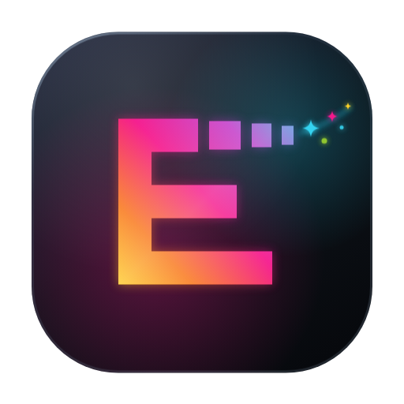
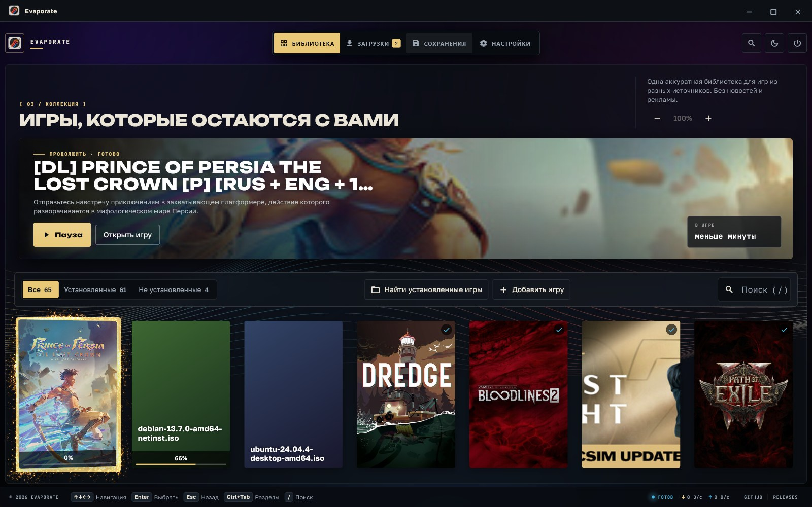
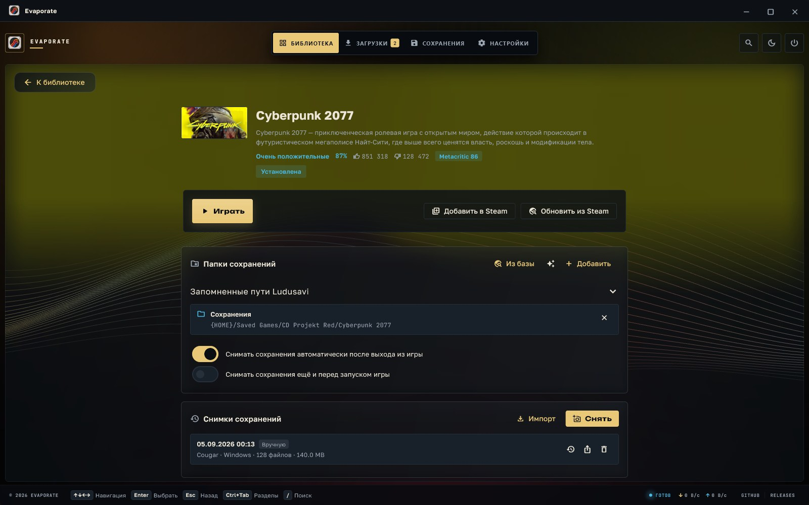
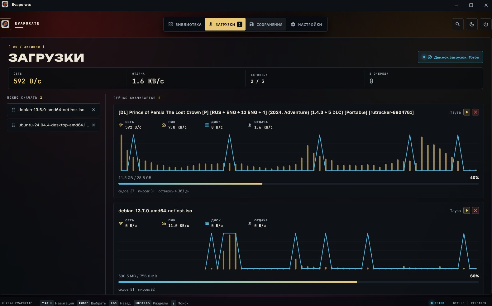
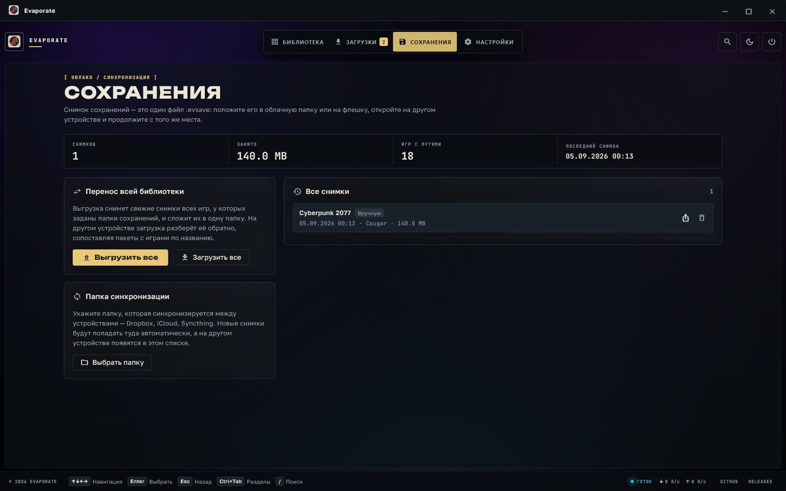
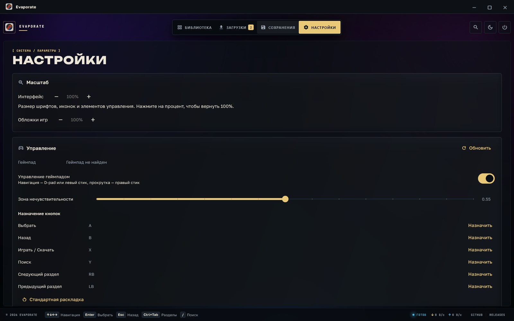
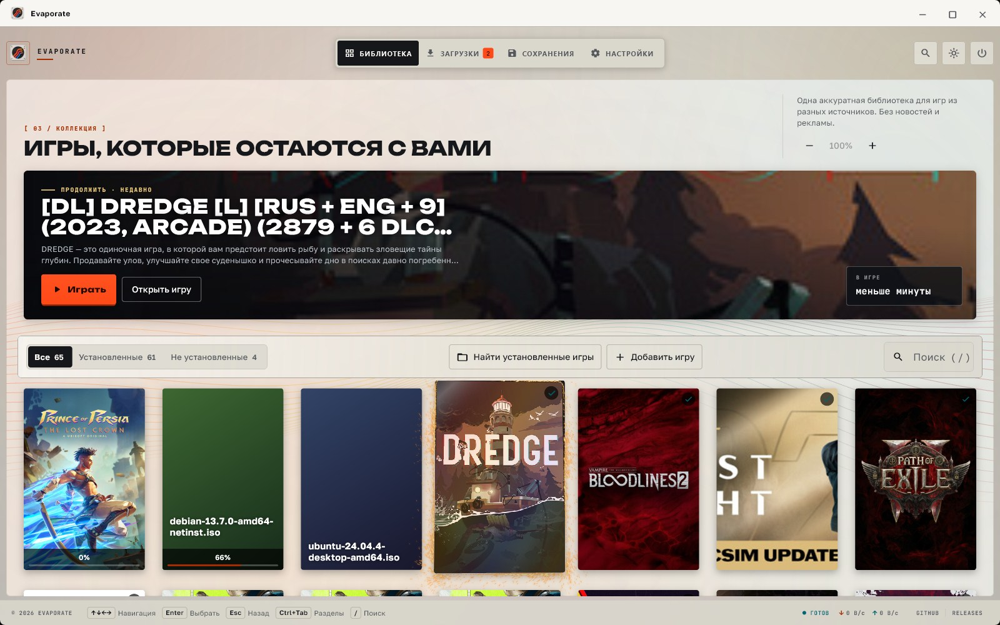

<a href="https://hecatoncheir.github.io/evaporate/"></a>

# Evaporate

*[In English](README.en.md)*

Десктопный лончер игр на Flutter: библиотека, загрузка по BitTorrent и —
главное — сохранения, которые можно забрать одним файлом и продолжить игру
на другом устройстве.

Приложение **не содержит каталога контента**. Источник каждой игры задаёт
пользователь: magnet-ссылка, `.torrent`-файл или уже готовая папка на диске.

## Как это выглядит



**Библиотека.** Сверху — та игра, к которой вы вернётесь: крупный кадр,
клавиша запуска и наигранное время. Ниже полки «Все / Установленные /
Не установленные» и сетка вертикальных обложек. Цвет в окно приносят сами
игры: подсветка берёт оттенок у выбранной.



**Страница игры.** Обложка уходит под шапку размытым фоном и тает к середине
экрана — страница отвечает, чья она, раньше, чем дочитаешь название. Под
описанием — оценка: подпись Steam словами, доля положительных обзоров, оба
счётчика и Metacritic. Слева «Играть», справа «Добавить в Steam» и «Обновить
из Steam». Ниже — папки сохранений: пути показаны шаблонами (`{HOME}/...`),
потому что так они и хранятся, и потому переносятся на другую машину.



**Загрузки.** Раздел начинается с показаний: скорость, отдача, сколько в
работе, сколько ждёт. У каждой задачи свой график — сеть линией, диск
столбцами. Слева очередь «Можно скачать»; лишнее оттуда убирается крестиком,
а `.torrent` можно бросить прямо в окно.



**Сохранения.** Сколько снимков, сколько занято, когда снимали последний раз.
Рядом — перенос всей библиотеки одним действием и папка синхронизации.
У снимка видно, с какого устройства он приехал.



**Настройки.** Масштаб интерфейса и отдельно — обложек. Ниже геймпад:
зона нечувствительности и переназначение любой кнопки нажатием.



**Светлая схема.** Не осветлённая тёмная, а самостоятельный облик: плоский
насыщенный цвет без переходов и чёрные надписи на оранжевом.

## Что умеет

- **Библиотека** — сетка вертикальных обложек, как в Steam: полки «Все»,
  «Установленные» и «Не установленные», локально сохранённые обложки Steam,
  статусы, наигранное время, дата последнего запуска.
- **Найти установленные игры** — выберите общую папку с играми (например,
  `Games` или `steamapps/common`) и отметьте найденные игры для добавления.
  Уже добавленные папки не предлагаются повторно.
- **Загрузки** — magnet и `.torrent` встроенным клиентом на Dart
  (`dtorrent_task_v2`): DHT, очередь, пауза/возобновление, **SOCKS5-прокси
  вплоть до peer-соединений**. Список загрузок переживает перезапуск.
  Скачанную раздачу можно выгрузить обратно в `.torrent` — в том числе ту,
  что пришла magnet-ссылкой: файл собирается из полученных метаданных.
  Ход каждой задачи виден графиком: сеть линией, диск столбцами. Очередь
  «Можно скачать» правится на месте, а удаление спрашивает отдельно, убрать
  ли вместе с ним и скачанные файлы.
- **Перетаскивание** — папку с игрой или `.torrent` можно бросить прямо в
  окно: папка добавится установленной игрой, раздача встанет в очередь
  загрузки. Принимают оба раздела, «Библиотека» и «Загрузки», — тот, что
  сейчас на экране.
- **Запуск** — поиск исполняемого файла в скачанной папке, запуск `.app`
  на macOS / `.exe` на Windows / бинарника на Linux, подсчёт времени игры.
- **Ярлык в Steam** — «Добавить в Steam» заводит игру в списке сторонних
  ярлыков Steam вместе с обложками: вертикальной, горизонтальной, широкой и
  логотипом. Дальше она запускается из самого Steam, из Big Picture и с
  телевизора через Steam Link. Steam при этом должен быть закрыт: при выходе
  он переписывает свой список ярлыков и затёр бы добавленное.
- **Оценка** — на странице игры видно, как её оценили: подпись Steam
  словами, доля положительных обзоров, оба счётчика и оценка прессы с
  Metacritic, если она у игры есть.
- **Сохранения** — снимки в формате `.evsave`, автоснимок после выхода из игры,
  восстановление с резервной копией, экспорт/импорт, папка синхронизации и
  перенос сохранений всей библиотеки одним действием.
- **Папки сохранений** — находятся сами, по открытой базе известных путей,
  так что задавать путь руками почти не приходится.

## Установка

Готовые сборки лежат на [странице релизов][releases]. Собирать ничего не
нужно, файл для каждой системы свой:

| Система | Файл | Что делать |
|---------|------|------------|
| Windows | `evaporate-<версия>-windows-setup.exe` | запустить: «Далее — Далее — Готово» |
| macOS | `evaporate-<версия>-macos.dmg` | открыть и перетащить Evaporate в «Программы» |
| Debian, Ubuntu | `evaporate-<версия>-linux-amd64.deb` | двойной щелчок или `sudo apt install ./файл.deb` |
| Прочие Linux | `evaporate-<версия>-linux-x86_64.run` | `chmod +x файл.run && ./файл.run` |
| Linux вручную | `evaporate-<версия>-linux-x64.tar.gz` | распаковать куда угодно — внутри папка `evaporate`, — и запустить `evaporate/evaporate` |

Архив `-macos.zip` нужен для обновления macOS из самого приложения.
На Windows оно скачивает и запускает `-windows-setup.exe`; `-windows.zip`
остаётся для ручной установки и диагностики.

Ни установщик Windows, ни бандл macOS не подписаны — сертификаты платные.
Поэтому при первом запуске SmartScreen покажет «Windows защитила ваш
компьютер» («Подробнее» → «Выполнить в любом случае»), а Gatekeeper на macOS
попросит открыть приложение через контекстное меню.

`.run` — обычный самораспаковывающийся установщик: кладёт приложение в
`~/.local/share/evaporate`, добавляет запись в меню и команду `evaporate`,
прав администратора не просит. Удаляется командой `evaporate-uninstall`;
настройки, библиотека и снимки сохранений при этом остаются. Ключи —
`--prefix DIR` и `--extract DIR`, если ставить никуда не надо.

Обновляться приложение умеет само: кнопка в настройках скачает новую версию,
проверит контрольную сумму и заменит установку. Пакет `.deb` — исключение, и
намеренно: он ложится в `/opt`, куда без прав администратора не записать, а
обновлять поставленное пакетным менеджером должен он же. Поставленное из
`.run` лежит в папке пользователя, и там обновление работает.

[releases]: https://github.com/Hecatoncheir/evaporate/releases/latest

## Управление: мышь, клавиатура, геймпад

Интерфейс полностью проходится без мыши. Клавиатура и геймпад сводятся к
одному набору действий (`NavAction`), поэтому ведут себя одинаково.

| Действие          | Клавиатура            | Геймпад             |
|-------------------|-----------------------|---------------------|
| Навигация         | стрелки, Tab          | D-pad, левый стик   |
| Выбрать           | Enter / Space         | A                   |
| Назад             | Escape                | B                   |
| Играть / Скачать  | Cmd+Enter, Ctrl+Enter | X                   |
| Поиск             | `/`, Cmd+F            | Y                   |
| Разделы           | Ctrl+Tab, Cmd+[ / ]   | LB / RB             |
| Прокрутка         | PageUp / PageDown     | правый стик         |

Элемент под фокусом обведён рамкой, список сам подкручивается к нему, а в
нижней строке показаны подсказки — кнопки геймпада, если он подключён, иначе
клавиши.

Геймпад читается пакетом `gamepads`, который приводит контроллеры к
стандартной раскладке Xbox по базе SDL, так что PlayStation, Xbox и
Switch-совместимые контроллеры работают без настройки. Раскладку всё равно
можно переопределить: **Настройки → Управление → Назначить** ждёт нажатия
кнопки и запоминает её. Там же выключается геймпад целиком и настраивается
зона нечувствительности стиков.

Удержание направления повторяет шаг (400 мс до старта, затем каждые 110 мс),
а у стиков гистерезис: порог отпускания ниже порога срабатывания, чтобы на
границе не было дребезга.

В поиске ↓, Enter и Escape возвращают фокус к выбранной игре (или к первому
результату фильтра), а ←/→ продолжают править запрос; на геймпаде возврат
работает по ↓, A и B. Запрос при этом не очищается: искали не затем, чтобы
начинать сначала.

## Прокси

**Настройки → Прокси**: тип (SOCKS5 или HTTP), хост, порт, логин, пароль.
Применяется кнопкой — смена прокси перезапускает активные задачи, иначе уже
открытые соединения продолжили бы идти мимо него.

Разница между типами принципиальная и вынесена прямо в интерфейс:

- **SOCKS5** — через прокси идёт и обмен с пирами (`useForPeers: true`), то
  есть торрент-трафик действительно скрыт;
- **HTTP** — покрывает только трекеры и обычные загрузки, обмен с пирами
  пойдёт напрямую.

Именно из-за этого движком стал `dtorrent_task_v2`, а не aria2: **aria2 не
поддерживает SOCKS вообще**, а его HTTP-прокси в торрентах покрывает лишь
обращения к трекерам.

Пароль прокси хранится в файле настроек открытым текстом — об этом сказано
и в самом интерфейсе.

## Уведомления

Правило простое: **SnackBar — для того, что пользователь только что нажал
сам; системное уведомление — для того, что закончилось в фоне.** Торрент
качается десятки минут, окно к этому моменту обычно свёрнуто, и всплывающее
сообщение в невидимом окне никому не поможет.

Системным уведомлением сообщаются три вещи:

- загрузка завершена — игра готова к запуску;
- загрузка сорвалась, с причиной;
- автоснимок сохранений после выхода из игры **не удался** — в интерфейсе он
  молчалив по замыслу, и без уведомления пользователь узнал бы об этом,
  только потеряв прогресс.

Об ошибке загрузки уведомление приходит один раз — на переходе в состояние
ошибки, а не на каждом опросе движка (он опрашивается раз в секунду).

Отключается в **Настройки → Уведомления**. Там же кнопка «Проверить»
(отправляет тестовое) и, на macOS, «Запросить разрешение»: система
спрашивает его один раз, и приложение делает это по кнопке, а не молча при
первом запуске. На Linux уведомления идут через D-Bus, на Windows — через
toast-механизм системы.

## Перенос сохранений между устройствами

Ключевая идея: в профиле игры хранится **не абсолютный путь**, а шаблон с
плейсхолдером — `{APPSUPPORT}/MyGame/Saves`. На другой машине (и на другой ОС)
тот же шаблон разворачивается в правильный локальный путь.

Файл `.evsave` — это обычный zip:

```
manifest.json          метаданные: игра, устройство, платформа, правила путей
data/<ruleId>/...      сами файлы сохранений
```

На диске у себя снимки лежат иначе — не архивами, а в хранилище по
содержимому: одинаковые файлы соседних снимков занимают место один раз и
хранятся сжатыми. Двадцать снимков одной игры различаются обычно одним файлом,
и на правдоподобном сейве это выходит примерно в одиннадцать раз меньше места,
чем архив на каждый снимок. На формат `.evsave` это не влияет: пакет собирается
по требованию и остаётся самодостаточным zip — его читают чужие сборки на
других устройствах.

При восстановлении правила сопоставляются сначала по идентификатору, затем **по
метке** — поэтому снимок, снятый на Windows, ложится в macOS-путь той же игры,
если у обоих правил метка одна и та же (например, «Сохранения»).

Три способа переноса:

1. **Вручную** — «Экспортировать файл», скопировать `.evsave` куда угодно, на
   другом устройстве «Импорт» → «Восстановить».
2. **Через папку синхронизации** — указать в настройках папку Dropbox / iCloud /
   Syncthing. Новые снимки попадают туда автоматически; на другом устройстве во
   вкладке «Сохранения» они появляются в списке с кнопкой «Применить»
   (импорт + восстановление одним действием).
3. **Всей библиотекой сразу** — «Выгрузить все» складывает по пакету на игру в
   одну папку, «Загрузить все» разбирает её обратно, сопоставляя пакеты с
   играми по названию.

Восстановление всегда сначала снимает резервную копию текущих сохранений.

**Массовая загрузка не затирает свежий прогресс молча.** Она сравнивает время
снятия пакета с временем последнего изменения сохранений и пропускает игры, где
это устройство ушло вперёд: пакет с другой машины запросто может оказаться
старым, а резервная копия — слабое утешение, если о ней не догадаться. Допуск в
две минуты не даёт расхождению часов поднимать ложную тревогу, а в диалоге
можно осознанно перекрыть проверку.

## Откуда берутся папки сохранений

Задавать путь для каждой игры руками — та самая скука, ради которой всё и
затевалось.

При добавлении установленной игры или завершении загрузки Evaporate один раз
ищет её в Steam и сохраняет ID, описание и файл обложки. Затем по этому ID
находит пути в Ludusavi. Результаты и признаки выполненных попыток хранятся
в библиотеке до удаления игры. Ошибка сети или отсутствие совпадения также
не вызывают повторных автоматических запросов после перезапуска. Повторить
поиск можно кнопками «Обновить из Steam» / «Найти в Steam» и «Из базы»
в карточке игры; «Из базы» обновляет манифест по запросу пользователя.

Шаблоны путей сохраняются даже до первого запуска игры. Маски раскрываются
локально перед снимком или массовым экспортом: появившиеся позднее профили
подхватываются без сети. Обложки показываются с диска, не запрашиваются при
открытии библиотеки. Если ID известен, похожее название другой игры в
Ludusavi не используется как запасной вариант.

Источник — [манифест проекта Ludusavi](https://github.com/mtkennerly/ludusavi-manifest):
открытая база, собранная из [PCGamingWiki](https://www.pcgamingwiki.com/wiki/Home).
Пятьдесят три тысячи игр, лицензия MIT. Скачивается по требованию и лежит в
кэше; в репозиторий и в сборку не входит ничего.

База пишет пути не готовыми, а с подстановками. Две из них раскрываются уже на
месте:

- `<base>` — папка самой игры, **самый частый плейсхолдер базы**. Лончер её
  знает точно: он эту игру и поставил. В правило она попадает как `{GAME}` и на
  другом устройстве развернётся в тамошнюю папку.
- маска «любой профиль» (`*`) раскрывается по тому, что действительно лежит на
  диске, и в правило попадают уже конкретные пути.

Что остаётся неразрешимым — пути через учётную запись магазина
(`<storeUserId>`) и корень чужого лончера (`<root>`). Это облако Steam; у игр,
которые ставит Evaporate, его нет.

### Наблюдение за запуском

База знает не всякую игру: торрент-релизов, малоизвестных вещей и всего, что
мимо Steam, в ней нет вовсе. Зато игра сама создаёт себе папку под сейвы, а
приложение знает точный промежуток, когда она работала, — оно её и запускало.

После выхода из игры Evaporate смотрит, что изменилось за это время в местах,
где игры держат сохранения, и в папке самой игры. Найденное показывается в
разделе «Папки сохранений» — с предложением, а не молча: рядом с сейвами игры
пишут логи, кэш шейдеров и телеметрию, и отличить одно от другого наверняка
нельзя.

Отбор идёт по нескольким признакам сразу: имя, похожее на название игры;
папка внутри игры; заведомо игровое место вроде «My Games»; расширения файлов.
Известные кэши и логи отбрасываются по имени, а папка, куда за сеанс насыпало
сотни файлов, теряет в весе — это кэш, а не сохранение. Запуски короче
тридцати секунд не осматриваются вовсе: это обычно неудачный старт.

Ветки реестра Windows база тоже знает. Переносить их приложение не умеет, но и
не молчит: если сейв игры лежит в реестре, об этом сказано прямо — иначе снимок
вышел бы неполным без единого слова.

Раньше рядом лежал сам **Ludusavi** — бинарник, который разворачивал `<base>`,
обходя папки Steam и GOG. Лончеру, который сам ставит игры, угадывать нечего,
поэтому бинарник убран: вместе с ним ушли закрепление версий с контрольными
суммами, запуск подпроцесса и то, что релиз Ludusavi под macOS собран только
под arm64.

## Связь с системой

- **Запуск вместе с системой** — задание launchd на macOS, запись XDG на Linux,
  ветка автозапуска текущего пользователя на Windows. Источник правды — сама
  система: убрали запись её средствами, и переключатель это покажет.
- **Окно** — размер и положение возвращаются такими, какими их оставили, а
  «всегда разворачивать» даётся отдельной галочкой. Положение с исчезнувшего
  монитора отбрасывается: окно за краем экрана выглядит как незапустившееся
  приложение.
- **Проверка обновлений** — приложение спрашивает GitHub и сообщает о новой
  версии. Скачивание и установка начинаются только по нажатию пользователя;
  для Linux-копии в системной папке приложение предложит обновиться тем же
  способом, которым её ставили.

## Требования

- Flutter 3.47+ (проверено на 3.47.4, Dart 3.13.3).
- Внешних программ не нужно: движок загрузок встроен в приложение.
- Для сборки под Linux нужны `libgtk-3-dev`, `libx11-dev` и `libxi-dev` —
  без двух последних не соберётся значок в трее.

Сборка под macOS требует **полного Xcode** (не только Command Line Tools) и
CocoaPods:

```bash
sudo xcode-select --switch /Applications/Xcode.app/Contents/Developer
```

## Запуск

```bash
flutter run -d macos
```

Тесты:

```bash
flutter test
```

Пересобрать размеры иконки из сохранённого исходника (на macOS, через `sips`):

```bash
python3 tool/make_icon.py
```

## Сборка в CI

[`.github/workflows/ci.yml`](.github/workflows/ci.yml) — шесть задач:

| Задача | Раннер | Что делает |
|--------|--------|------------|
| Формат и анализ | ubuntu | `dart format`, `flutter analyze`, `bloc lint`, сверка регистраторов плагинов, раздел `CHANGELOG` на теге |
| Тесты | ubuntu, macOS, Windows | `flutter test` в случайном порядке; на ubuntu — с покрытием и его порогом |
| Сборка macOS | macos | `.app`: архивом `ditto` и образом `.dmg` |
| Сборка Linux | ubuntu | bundle со всеми зависимостями: `.tar.gz`, пакет `.deb` и `.run` |
| Сборка Windows | windows | Release-каталог: `.zip` и установщик Inno Setup |
| Приложить к релизу | ubuntu | выкладывает файлы и `SHA256SUMS` в релиз для тега `v*` |

Обновление по нажатию ищет в релизе `-macos.zip`, `-linux-x64.tar.gz` или
`-windows-setup.exe`. На macOS и Linux папку установки заменяет отдельный
помощник. На Windows приложение запускает сам Inno Setup отсоединённым
процессом; после тихой установки установщик заново открывает Evaporate.
[`release_artifacts_test.dart`](test/tool/release_artifacts_test.dart)
следит, чтобы имена не разошлись. Рецепты упаковки лежат рядом с кодом
платформы: [`windows/installer.iss`](windows/installer.iss),
[`tool/package_macos.sh`](tool/package_macos.sh),
[`tool/package_linux.sh`](tool/package_linux.sh),
[`tool/package_run.sh`](tool/package_run.sh) — их можно запустить и руками.

На пуш в `main` идут только анализ и тесты. Сборки трёх платформ запускаются
на теге `v*` — и тогда же готовые файлы ложатся в релиз, — а ещё раз в неделю
по расписанию: тесты не компилируют ни раннеры плагинов, ни установщик, и
сломанная сборка иначе обнаруживалась бы в день выпуска. На пуше они выясняли
бы то же самое, что и тесты, только вчетверо дольше: сборка macOS занимает
минуты, а ответ «тесты прошли» нужен сразу.

Проверить сборку, не выпуская версию, можно ручным запуском прогона
(`workflow_dispatch`) — сборки в нём тоже выполняются. Идут они только после
успешных анализа и тестов (`needs: [analyze, test]`). Всё, что задачи
анализа и тестов проверяют на каждой правке, локально запускает
`dart tool/gate.dart`.

Большинству тестов не нужны ни Xcode, ни сеть, ни геймпад: движок создаётся с
`autoStart: false` и очередь проверяется без единого соединения, а события
контроллера подаются напрямую в обход плагина. Единственное исключение —
работа с реестром: она проверяется на сборке под Windows, а на остальных
системах пропускается.

Версия Flutter зафиксирована в `env.FLUTTER_VERSION`. Чтобы всегда брать
свежую стабильную, уберите `flutter-version` и оставьте `channel: stable`.

Собранный `.app` подписан ad-hoc: он запустится на вашей машине, но на чужой
Gatekeeper потребует «Открыть всё равно». Для нормальной подписи нужен
сертификат Apple Developer в секретах репозитория.

## Устройство кода

```
lib/
  bloc/          SettingsBloc, LibraryBloc, DownloadsBloc, NavigationBloc
  core/          пути приложения, шаблоны путей сохранений, JSON-хранилище
  input/         NavAction, раскладка геймпада, сервис ввода, InputScope
  models/        Game, AppSettings, SaveProfile, SaveSnapshot, DownloadTask
  services/
    download/    DownloadEngine (контракт) + dtorrent: очередь и прокси
    saves/       упаковка снимков, база путей, поиск папок
    launch/      запуск игр, поиск исполняемых файлов
    metadata/    разбор имени раздачи, каталог Steam, кэш обложек
    system/      автозапуск, геометрия окна, проверка обновлений
  ui/            оболочка, библиотека, загрузки, сохранения, настройки
tool/            генерация иконки и вспомогательные скрипты
```

## Состояние: Bloc с событиями + provider

Семь блоков держат приложение — `SettingsBloc`, `LibraryBloc`,
`SavesBloc`, `DownloadsBloc`, `NavigationBloc`, `UpdateBloc`,
`DownloadHistoryBloc`, — и ещё семь живут при своих экранах и диалогах:
поиск установленных игр, добавление игры, журнал, форма правила, форма
прокси, предпросмотр восстановления, запрос и полка библиотеки. Событий около
сотни. Каждая фича лежит в своей папке (`bloc/<feature>/`) тремя файлами:
события, состояние и обработчики, связанные через `part`. Состояния
иммутабельны (`Equatable`).

Cubit в приложении не осталось: состояние заводится блоком с событиями,
потому что у события есть имя — и в журнал уходит «что случилось → что
изменилось». Для приложения, где журнал и есть единственный способ узнать,
что произошло у человека, это главное.

`flutter_bloc` сам построен на `provider`, поэтому оба пакета используются
по назначению: блоки раздаёт `BlocProvider`, а сервисы без состояния
(`GamepadService`) — обычный `Provider`.

Событийная модель здесь не церемония: внешние источники подают события
наравне с нажатиями пользователя. Лаунчер сообщает о завершении процесса
через `GameExited`, движок загрузок — через `EngineTasksChanged`,
`EngineStatusChanged` и `EngineStatsChanged`. Обработчик решает, что делать,
и правит состояние в одном месте.

Асинхронные операции не пробрасывают исключения в виджеты. Блок держит
множество ключей выполняющихся операций (`state.isBusy(...)`) и одноразовое
сообщение `Notice`, а SnackBar'ом его показывает только
оболочка — по слушателю на каждый блок с сообщениями. Поэтому в экранах нет ни `bool _busy`, ни `try/catch` вокруг
вызовов: работа, у которой бывает отказ, идёт событием, а ответ приходит
состоянием. У `Notice` есть счётчик `seq`: без него два одинаковых сообщения
подряд считались бы одним состоянием, и второе не показалось бы.

Событие ничего не возвращает, и это меняет пару мест. `AddGameBloc`
сам генерирует идентификатор и передаёт его в `GameAdded`, чтобы сразу знать,
какую игру выделять. А перед стартом загрузки он дожидается, пока игра
действительно появится в состоянии, — иначе два блока могли бы разойтись
в порядке обработки.

## Внешний вид

Схем две, и это **два самостоятельных облика**, а не одна палитра с
вывернутой яркостью. Ночная — чернильный корпус кинозала, тёплое золото
главного действия и холодный сигнальный голубой на показаниях. Дневная —
светлый корпус измерительного прибора: плоский насыщенный цвет без
переходов, чёрные надписи на оранжевом и клавиша на своём тёмном торце.
Осветлённая копия ночной выглядела бы выцветшей, и обратно — тоже. Выбор в
настройках: тёмная, светлая или «как в системе»; по умолчанию последнее.

Контраст не подбирался на глаз: `test/ui/theme/theme_test.dart` меряет отношение для
каждого цвета на каждой подложке и требует норм WCAG — 4.5 для подписей,
7 для основного текста. Он же заставил отойти от исходных значений там, где
текст иначе было бы не прочесть.

**Фирменный цвет разделён на две роли, и путать их нельзя.** `primary` — для
текста и значков, он проверен по контрасту на всех подложках; `primaryFill` —
для заливок, на нём пишут `onPrimary`. Разделение оплачено светлой схемой:
насыщенный оранжевый хорош как блок под надписью и не дотягивает до нормы как
текст на светлом фоне, так что один токен на две роли означал бы либо тусклые
кнопки, либо нечитаемые подписи. Так же разведены `accent` и `accentFill`.
Ещё три токена описывают **материал**, а не смысл: `glow` (ореол; днём
прозрачный — светлый корпус не светится), `depth` (торец под клавишей; ночью
прозрачный) и `shadow`.

Цвета раздаёт расширение темы (`context.colors.textSecondary`), а не
константы: иначе две схемы не сосуществовали бы. Определены они все в
`lib/ui/theme/` — палитры схем в `palette.dart`, цвета украшений и игр в
`decor_colors.dart`, — и тест запрещает новые литералы цветов в остальных
файлах приложения. Геометрия корпуса — три радиуса в `EvaporateTheme`,
одни на обе схемы: разные углы читались бы как два разных приложения, а числа
в `BorderRadius.circular(…)` по месту не пишут. Моторика тоже токены
(`EvaporateMotion`): четыре ступени длительности и кривые к ним, и там же
соблюдается системная просьба не двигаться — проверять её в каждом виджете
значило бы однажды забыть.

Три шрифта, все вшиты в сборку, а не подтягиваются из сети: **Unbounded** на
заголовки и главные клавиши (широкий геометричный — звучит как надпись на
корпусе), **Golos Text** на тексты и подписи, **JetBrains Mono** на пути,
размеры и показания. Все три рисовали с кириллицей, а не добавляли её позже;
начертания вариативные — один файл на семейство. Заголовки набраны заглавными
с **положительным** разрядом: у Unbounded прижатые заглавные слипаются, и
привычный для узких шрифтов минус портит именно то место, ради которого шрифт
и взят. Подписи разделов заглавные только на вид — диктору уходит обычное
слово, потому что часть читалок разбирает капс по буквам, как сокращение.

**Разделы начинаются с показаний, а не с подробностей.** Одна панель в
несколько граф через волосяную черту: на сохранениях — сколько снимков,
сколько занято, когда снимали последний раз; на загрузках — скорость, отдача,
сколько в работе, сколько ждёт. Это не украшение: те же числа раньше были
рассыпаны по углам карточек, и на главный вопрос раздела экран не отвечал.
Набраны моношириной с табличными цифрами, иначе строка дёргается на каждом
обновлении, а погасшая графа означает «нечего показывать».

**Цвет в оболочку приносят игры, а не корпус.** Окно заливают три больших
перехода в цветах выбранной игры, а панель поверх нарочно неплотная — заливка
в упор погасила бы единственный цвет в окне. Оттенок берётся от названия, а
не от пикселей обложки: разбор картинки означал бы её декодирование на каждую
перелистку, а свет всё равно размыт до пятна. И оттенки не весь круг, а шесть
выверенных якорей: свободный оттенок от хеша рано или поздно выдаёт
болотно-зелёный, и оболочка выглядит не «своей у каждого», а сломанной.

На странице игры то же делает сама обложка: размытая, затемнённая и тающая к
середине экрана. Три слоя, и каждый нужен — размытие, чтобы под текстом не
читались детали, затемнение, чтобы белый текст на светлой обложке остался
текстом, и растворение к низу, чтобы у фона был конец, а не обрезанный край.
Берётся тот же файл, что уже показан на странице: его расшифровку Flutter
держит в кэше, и второй показ не стоит ничего.

Украшения — **не один выключатель, а флаг на каждое**: искры, волны, фольга
на обложке, наклон карточки, частицы, капли, рамка выбора, окружение, пробег
света по крупной обложке, обложка фоном на странице игры. У них разная цена и
разный вкус, а общий переключатель означал бы «или всё, или ничего». Старый
общий флаг остался ради уже записанных профилей и читается наравне с новыми.

Масштабов два, и они независимы: интерфейс целиком — 85–125%, плитки
библиотеки — 75–150%. Интерфейсный не крутит один лишь размер шрифта:
раскладка считается по увеличенному логическому размеру, а затем
масштабируется целиком — иначе вместе с текстом не выросли бы заданные числом
значки, области нажатия и диалоги. Кнопки окна остаются снаружи: они
принадлежат системе. Нажатие на процент возвращает свой масштаб к 100%.

Крупная обложка библиотеки не прячется там, где просто меньше места: ниже 760
точек по высоте она рисуется полосой — название в одну строку, клавиши
справа, — а убирается только ниже 520, где иначе не осталось бы места самой
полке. Широкие экраны зажаты по ширине и отцентрованы: дальше строка описания
перестаёт читаться, карточка задачи превращается в полосу, а график скорости —
в обои.

Панель окна рисуется самим приложением: перетаскивание за заголовок, двойной
щелчок для разворачивания и свои кнопки сворачивания, восстановления и
закрытия. Изменение размера доступно за края. Скругление сохраняется на
macOS, запрашивается у DWM на Windows 11 и рисуется через прозрачные углы на
Linux (нужен композитный оконный менеджер). На Windows 10 углы прямые; в
развёрнутом и полноэкранном режимах скругление отключается.

Анимации короткие, и их немного — это осознанный выбор. Приложением управляют
и с геймпада, где пользователь держит направление и ждёт мгновенной реакции, а
любой переход там читается как подтормаживание. Кадры всех украшений гонит
одни часы, и они сами останавливаются на системной просьбе не двигаться, на
свёрнутом окне, выключенном `TickerMode` и неактивном маршруте: украшение не
должно жечь батарею за спиной.

Иконка нарисована вектором, а не выпрошена у генератора картинок: монограмма
«E», у которой верхняя перекладина теряет вещество — блоки короче, ниже и
дальше друг от друга, а за ними уходят искры. Имя приложения, сказанное самой
буквой. Залита жидкой радугой от жёлтого через розовое к холодному голубому:
это единственное место, где приложение отступает от своей палитры, — иконке
позволено быть громче интерфейса.

Исходников два, и это не удобство. Крупные размеры берут рисунок со свечением
и искрами, мелкие — тот, где эффектов нет вовсе, градиент короче, а самый
дальний блок убран: ореол подсвечивает плашку и в 16 точек размывает контур
ровно на ту величину, которой буква и нарисована. Оба лежат в
`docs/branding/` вместе с разбором ([brand.md](docs/branding/brand.md)), а
`tool/make_icon.py` рисует из них каждый размер заново — размеры macOS, PNG
для Linux и многослойные ICO для Windows и трея. Рисует безголовый браузер,
поэтому упаковка работает на всех трёх системах, а не только на macOS, как
было с `sips`.

Снимки экрана для этого файла и для сайта делает
[`tool/capture_window.ps1`](tool/capture_window.ps1): он снимает само окно, а
не экран, и **отказывается работать**, если окно не удалось вывести вперёд —
иначе в кадр молча попало бы чужое, и подмену было бы видно только глазом.

## Участие

Отчёты об ошибках, правки перевода и замечания к формулировкам уместны —
как это устроено, описано в [CONTRIBUTING.md](CONTRIBUTING.md).

## Лицензия

Evaporate распространяется под [MIT](LICENSE). Вместе с ним поставляется
чужая работа со своими условиями — база путей под MIT и три шрифта под OFL;
все они перечислены в [NOTICE.md](NOTICE.md).

## Заметки по платформам

- **macOS**: песочница отключена в `*.entitlements` — иначе невозможны ни запуск
  игр, ни доступ к папкам сохранений других приложений. Такая сборка не
  предназначена для App Store.
- Пакеты `.evsave` приходят извне, поэтому при распаковке проверяется выход за
  пределы целевой папки (zip-slip) — на это есть тест.
- Имена файлов чистятся так, чтобы буквы нелатинских алфавитов оставались. В
  Dart `\w` — это только латиница, и очистка по нему превращала русские
  названия в одинаковые ряды подчёркиваний: экспорт разных игр затирал сам
  себя, пока это не поймал тест.
